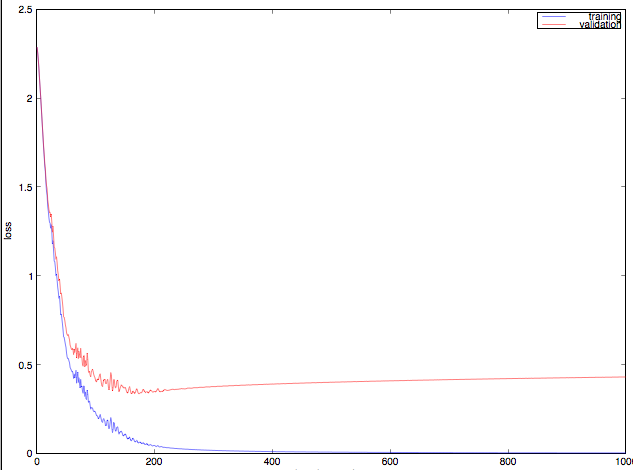
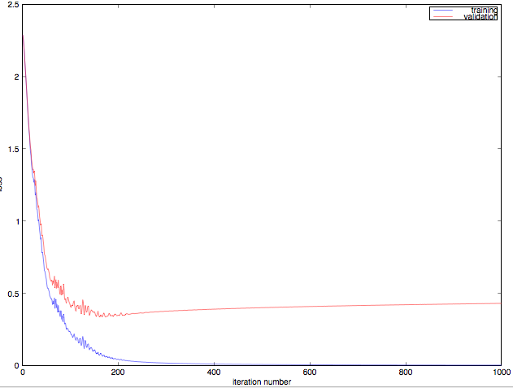

question: question 4
====================

Let's try a variety of learning rates, to find out which works best. We'll try 0.002, 0.01, 0.05, 0.2, 1.0, 5.0, and 20.0. We'll try all of those both without momentum (i.e. momentum=0.0 in the program) and with momentum (i.e. momentum=0.9 in the program), so we have a total of 7 x 2 = 14 experiments to run. Remember, what we're interested in right now is the loss on the training data, because that shows how well the optimization works.

run 
------
a3(0, 10, 70, 0.002, 0, false, 4)
a3(0, 10, 70, 0.01, 0, false, 4)
a3(0, 10, 70, 0.05, 0, false, 4)
a3(0, 10, 70, 0.02, 0, false, 4)
a3(0, 10, 70, 1.0, 0, false, 4)
a3(0, 10, 70, 5.0, 0, false, 4)
a3(0, 10, 70, 20.0, 0, false, 4)

a3(0, 10, 70, 0.002, 0.9, false, 4)
a3(0, 10, 70, 0.01,  0.9, false, 4)
a3(0, 10, 70, 0.05, 0.9, false, 4)
a3(0, 10, 70, 0.02, 0.9, false, 4)
a3(0, 10, 70, 1.0, 0.9, false, 4)
a3(0, 10, 70, 5.0, 0.9, false, 4)
a3(0, 10, 70, 20.0, 0.9, false, 4)

>> a3(0, 10, 70, 0.002, 0, false, 4)

The loss on the training data is 2.304283
The classification error rate on the training data is 0.900000

The loss on the validation data is 2.304338
The classification error rate on the validation data is 0.900000

The loss on the test data is 2.304352
The classification error rate on the test data is 0.900000
>> a3(0, 10, 70, 0.01, 0, false, 4)

The loss on the training data is 2.302117
The classification error rate on the training data is 0.877000

The loss on the validation data is 2.302284
The classification error rate on the validation data is 0.882000

The loss on the test data is 2.302230
The classification error rate on the test data is 0.881222
>> a3(0, 10, 70, 0.05, 0, false, 4)

The loss on the training data is 2.292967
The classification error rate on the training data is 0.868000

The loss on the validation data is 2.293696
The classification error rate on the validation data is 0.871000

The loss on the test data is 2.293294
The classification error rate on the test data is 0.872111
>> a3(0, 10, 70, 0.02, 0, false, 4)

The loss on the training data is 2.299680
The classification error rate on the training data is 0.868000

The loss on the validation data is 2.299987
The classification error rate on the validation data is 0.872000

The loss on the test data is 2.299847
The classification error rate on the test data is 0.870444
>> a3(0, 10, 70, 1.0, 0, false, 4)

The loss on the training data is 1.598844
The classification error rate on the training data is 0.587000

The loss on the validation data is 1.608040
The classification error rate on the validation data is 0.600000

The loss on the test data is 1.596059
The classification error rate on the test data is 0.584444
>> a3(0, 10, 70, 5.0, 0, false, 4)

The loss on the training data is 2.301322
The classification error rate on the training data is 0.900000

The loss on the validation data is 2.301741
The classification error rate on the validation data is 0.900000

The loss on the test data is 2.302015
The classification error rate on the test data is 0.900000
>> a3(0, 10, 70, 20.0, 0, false, 4)

The loss on the training data is 2.302585
The classification error rate on the training data is 0.904000

The loss on the validation data is 2.302585
The classification error rate on the validation data is 0.914000

The loss on the test data is 2.302585
The classification error rate on the test data is 0.915000

after run with momentum
----------
>> a3(0, 10, 70, 0.002, 0.9, false, 4)

The loss on the training data is 2.300135
The classification error rate on the training data is 0.900000

The loss on the validation data is 2.300422
The classification error rate on the validation data is 0.900000

The loss on the test data is 2.300287
The classification error rate on the test data is 0.900000
>> a3(0, 10, 70, 0.01,  0.9, false, 4)

The loss on the training data is 2.284022
The classification error rate on the training data is 0.685000

The loss on the validation data is 2.285377
The classification error rate on the validation data is 0.702000

The loss on the test data is 2.284538
The classification error rate on the test data is 0.693444
>> a3(0, 10, 70, 0.05, 0.9, false, 4)

The loss on the training data is 2.008606
The classification error rate on the training data is 0.731000

The loss on the validation data is 2.018598
The classification error rate on the validation data is 0.749000

The loss on the test data is 2.008179
The classification error rate on the test data is 0.724778
>> a3(0, 10, 70, 0.02, 0.9, false, 4)

The loss on the training data is 2.252607
The classification error rate on the training data is 0.672000

The loss on the validation data is 2.255648
The classification error rate on the validation data is 0.686000

The loss on the test data is 2.253559
The classification error rate on the test data is 0.665556
>> a3(0, 10, 70, 1.0, 0.9, false, 4)

The loss on the training data is 2.018723
The classification error rate on the training data is 0.761000

The loss on the validation data is 2.041323
The classification error rate on the validation data is 0.752000

The loss on the test data is 2.038473
The classification error rate on the test data is 0.755333
>> a3(0, 10, 70, 5.0, 0.9, false, 4)

The loss on the training data is 2.302585
The classification error rate on the training data is 0.886000

The loss on the validation data is 2.302585
The classification error rate on the validation data is 0.891000

The loss on the test data is 2.302585
The classification error rate on the test data is 0.881000
>> a3(0, 10, 70, 20.0, 0.9, false, 4)

The loss on the training data is 2.302585
The classification error rate on the training data is 0.896000

The loss on the validation data is 2.302585
The classification error rate on the validation data is 0.891000

The loss on the test data is 2.302585
The classification error rate on the test data is 0.890778

best result
--- 
no momentum, with learn rate 1.0
The loss on the training data is 1.598844
The classification error rate on the training data is 0.587000

The loss on the validation data is 1.608040
The classification error rate on the validation data is 0.600000

The loss on the test data is 1.596059
The classification error rate on the test data is 0.584444

quiz6  - a3(0, 200, 1000, 0.35, 0.9, false, 100)
=======
What is the validation data classification loss now? Write your answer with at least 5 digits after the decimal point.
result
----
>> a3(0, 200, 1000, 0.35, 0.9, false, 100)
Gradient test passed. That means that the gradient that your code computed is within 0.001% of the gradient that the finite difference approximation computed, so the gradient calculation procedure is probably correct (not certainly, but probably).
After 100 optimization iterations, training data loss is 0.231650, and validation data loss is 0.416469
After 200 optimization iterations, training data loss is 0.044371, and validation data loss is 0.348192
After 300 optimization iterations, training data loss is 0.016940, and validation data loss is 0.375967
After 400 optimization iterations, training data loss is 0.010131, and validation data loss is 0.390319
After 500 optimization iterations, training data loss is 0.007063, and validation data loss is 0.400496
After 600 optimization iterations, training data loss is 0.005355, and validation data loss is 0.408513
After 700 optimization iterations, training data loss is 0.004279, and validation data loss is 0.415153
After 800 optimization iterations, training data loss is 0.003545, and validation data loss is 0.420827
After 900 optimization iterations, training data loss is 0.003014, and validation data loss is 0.425784
After 1000 optimization iterations, training data loss is 0.002614, and validation data loss is 0.430185
Gradient test passed. That means that the gradient that your code computed is within 0.001% of the gradient that the finite difference approximation computed, so the gradient calculation procedure is probably correct (not certainly, but probably).

The loss on the training data is 0.002614
The classification error rate on the training data is 0.000000

The loss on the validation data is 0.430185
The classification error rate on the validation data is 0.087000

The loss on the test data is 0.464988
The classification error rate on the test data is 0.093778
>>
 image is like:
 

quiz7 - a3(0, 200, 1000, 0.35, 0.9, true, 100)
----------

Gradient test passed. That means that the gradient that your code computed is within 0.001% of the gradient that the finite difference approximation computed, so the gradient calculation procedure is probably correct (not certainly, but probably).
After 100 optimization iterations, training data loss is 0.231650, and validation data loss is 0.416469
After 200 optimization iterations, training data loss is 0.044371, and validation data loss is 0.348192
After 300 optimization iterations, training data loss is 0.016940, and validation data loss is 0.375967
After 400 optimization iterations, training data loss is 0.010131, and validation data loss is 0.390319
After 500 optimization iterations, training data loss is 0.007063, and validation data loss is 0.400496
After 600 optimization iterations, training data loss is 0.005355, and validation data loss is 0.408513
After 700 optimization iterations, training data loss is 0.004279, and validation data loss is 0.415153
After 800 optimization iterations, training data loss is 0.003545, and validation data loss is 0.420827
After 900 optimization iterations, training data loss is 0.003014, and validation data loss is 0.425784
After 1000 optimization iterations, training data loss is 0.002614, and validation data loss is 0.430185
Gradient test passed. That means that the gradient that your code computed is within 0.001% of the gradient that the finite difference approximation computed, so the gradient calculation procedure is probably correct (not certainly, but probably).
Early stopping: validation loss was lowest after 161 iterations. We chose the model that we had then.

The loss on the training data is 0.071471
The classification error rate on the training data is 0.017000

The loss on the validation data is 0.334505
The classification error rate on the validation data is 0.095000

The loss on the test data is 0.371140
The classification error rate on the test data is 0.098556

观察
----
加上 early stoping 以后, 在 validate 上面的错误要小一些, 
0.430185 vs 0.334505

quiz8 : weight decay: lowest on classification loss
====================
a3(0.0, 10, 70, 0.005, 0, false, 4)
a3(10, 10, 70, 0.005, 0, false, 4)
a3(0.1, 10, 70, 0.005, 0, false, 4)
a3(1, 10, 70, 0.005, 0, false, 4)
a3(0.01, 10, 70, 0.005, 0, false, 4)
a3(0.001, 10, 70, 0.005, 0, false, 4)
a3(0.0001, 10, 70, 0.005, 0, false, 4)

result
------

>> a3(1, 10, 70, 0.002, 0, false, 4)
The loss on the training data is 7.328641
The classification loss (i.e. without weight decay) on the training data is 2.303872
The classification error rate on the training data is 0.900000

The loss on the validation data is 7.328682
The classification loss (i.e. without weight decay) on the validation data is 2.303914
The classification error rate on the validation data is 0.900000

The loss on the test data is 7.328693
The classification loss (i.e. without weight decay) on the test data is 2.303924
The classification error rate on the test data is 0.900000
>> a3(0.001, 10, 70, 0.002, 0, false, 4)
Gradient test passed. That means that the gradient that your code computed is within 0.001% of the gradient that the finite difference approximation computed, so the gradient calculation procedure is probably correct (not certainly, but probably).
The loss on the training data is 2.310931
The classification loss (i.e. without weight decay) on the training data is 2.304282
The classification error rate on the training data is 0.900000

The loss on the validation data is 2.310986
The classification loss (i.e. without weight decay) on the validation data is 2.304337
The classification error rate on the validation data is 0.900000

The loss on the test data is 2.311000
The classification loss (i.e. without weight decay) on the test data is 2.304352
The classification error rate on the test data is 0.900000
>> a3(5, 10, 70, 0.002, 0, false, 4)
The loss on the training data is 10.445145
The classification loss (i.e. without weight decay) on the training data is 2.303006
The classification error rate on the training data is 0.896000

The loss on the validation data is 10.445159
The classification loss (i.e. without weight decay) on the validation data is 2.303020
The classification error rate on the validation data is 0.899000

The loss on the test data is 10.445162
The classification loss (i.e. without weight decay) on the test data is 2.303023
The classification error rate on the test data is 0.897667
>> a3(0.0001, 10, 70, 0.002, 0, false, 4)
The loss on the training data is 2.304948
The classification loss (i.e. without weight decay) on the training data is 2.304283
The classification error rate on the training data is 0.900000

The loss on the validation data is 2.305003
The classification loss (i.e. without weight decay) on the validation data is 2.304338
The classification error rate on the validation data is 0.900000

The loss on the test data is 2.305017
The classification loss (i.e. without weight decay) on the test data is 2.304352
The classification error rate on the test data is 0.900000
>> a3(0.0, 10, 70, 0.002, 0, false, 4)
The loss on the training data is 2.304283
The classification error rate on the training data is 0.900000

The loss on the validation data is 2.304338
The classification error rate on the validation data is 0.900000

The loss on the test data is 2.304352
The classification error rate on the test data is 0.900000
>> a3(0.01, 10, 70, 0.002, 0, false, 4)
The loss on the training data is 2.370595
The classification loss (i.e. without weight decay) on the training data is 2.304278
The classification error rate on the training data is 0.900000

The loss on the validation data is 2.370650
The classification loss (i.e. without weight decay) on the validation data is 2.304333
The classification error rate on the validation data is 0.900000

The loss on the test data is 2.370664
The classification loss (i.e. without weight decay) on the test data is 2.304347
The classification error rate on the test data is 0.900000
>>
best is
-------
>> a3(5, 10, 70, 0.002, 0, false, 4)
The loss on the training data is 10.445145
The classification loss (i.e. without weight decay) on the training data is 2.303006
The classification error rate on the training data is 0.896000

The loss on the validation data is 10.445159
The classification loss (i.e. without weight decay) on the validation data is 2.303020
The classification error rate on the validation data is 0.899000

quiz9
======
a3(0, 130, 70, 1.0, 0, false, 4)
a3(0, 30, 70, 1.0, 0, false, 4)
a3(0, 100, 70, 1.0, 0, false, 4)
a3(0, 170, 70, 1.0, 0, false, 4)
a3(0, 10, 70, 1.0, 0, false, 4)

result is
--------

>> a3(0, 130, 70, 0.002, 0, false, 4)
The loss on the training data is 2.299431
The classification error rate on the training data is 0.895000

The loss on the validation data is 2.299621
The classification error rate on the validation data is 0.883000

The loss on the test data is 2.299572
The classification error rate on the test data is 0.892556
>> a3(0, 30, 70, 0.002, 0, false, 4)
The loss on the training data is 2.302650
The classification error rate on the training data is 0.900000

The loss on the validation data is 2.302783
The classification error rate on the validation data is 0.900000

The loss on the test data is 2.302771
The classification error rate on the test data is 0.900000
>> a3(0, 100, 70, 0.002, 0, false, 4)
The loss on the training data is 2.300979
The classification error rate on the training data is 0.902000

The loss on the validation data is 2.300931
The classification error rate on the validation data is 0.901000

The loss on the test data is 2.300983
The classification error rate on the test data is 0.900111
>> a3(0, 170, 70, 0.002, 0, false, 4)
The loss on the training data is 2.300059
The classification error rate on the training data is 0.858000

The loss on the validation data is 2.300185
The classification error rate on the validation data is 0.852000

The loss on the test data is 2.300132
The classification error rate on the test data is 0.853667
>> a3(0, 10, 70, 0.002, 0, false, 4)
The loss on the training data is 2.304283
The classification error rate on the training data is 0.900000

The loss on the validation data is 2.304338
The classification error rate on the validation data is 0.900000

The loss on the test data is 2.304352
The classification error rate on the test data is 0.900000

run with learn rate 1.0
------

>> a3(0, 130, 70, 1.0, 0, false, 4)

The loss on the training data is 1.628498
The classification error rate on the training data is 0.638000

The loss on the validation data is 1.661510
The classification error rate on the validation data is 0.663000

The loss on the test data is 1.638096
The classification error rate on the test data is 0.654556
>> a3(0, 30, 70, 1.0, 0, false, 4)
The loss on the training data is 1.547889
The classification error rate on the training data is 0.576000

The loss on the validation data is 1.567937
The classification error rate on the validation data is 0.587000

The loss on the test data is 1.553474
The classification error rate on the test data is 0.579222
>> a3(0, 100, 70, 1.0, 0, false, 4)

The loss on the training data is 1.898072
The classification error rate on the training data is 0.695000

The loss on the validation data is 1.915524
The classification error rate on the validation data is 0.721000

The loss on the test data is 1.908374
The classification error rate on the test data is 0.718333
>> a3(0, 170, 70, 1.0, 0, false, 4)

The loss on the training data is 1.936884
The classification error rate on the training data is 0.767000

The loss on the validation data is 1.954696
The classification error rate on the validation data is 0.774000

The loss on the test data is 1.945574
The classification error rate on the test data is 0.767222
>> a3(0, 10, 70, 1.0, 0, false, 4)

The loss on the training data is 1.598844
The classification error rate on the training data is 0.587000

The loss on the validation data is 1.608040
The classification error rate on the validation data is 0.600000

The loss on the test data is 1.596059
The classification error rate on the test data is 0.584444

quiz 10: with early stoping
==========================
a3(0, 18, 70, 1.0, 0, true, 4)
a3(0, 113, 70, 1.0, 0, true, 4)
a3(0, 83, 70, 1.0, 0, true, 4)
a3(0, 37, 70, 1.0, 0, true, 4)
a3(0, 236, 70, 1.0, 0, true, 4)

>> a3(0, 18, 70, 1.0, 0, true, 4)
Early stopping: validation loss was lowest after 69 iterations. We chose the model that we had then.

The loss on the training data is 1.670481
The classification error rate on the training data is 0.553000

The loss on the validation data is 1.686731
The classification error rate on the validation data is 0.555000

The loss on the test data is 1.670922
The classification error rate on the test data is 0.554222
>> a3(0, 113, 70, 1.0, 0, true, 4)

Early stopping: validation loss was lowest after 70 iterations. We chose the model that we had then.

The loss on the training data is 2.179621
The classification error rate on the training data is 0.720000

The loss on the validation data is 2.189989
The classification error rate on the validation data is 0.730000

The loss on the test data is 2.184190
The classification error rate on the test data is 0.727667
>> a3(0, 83, 70, 1.0, 0, true, 4)
Early stopping: validation loss was lowest after 69 iterations. We chose the model that we had then.

The loss on the training data is 1.461168
The classification error rate on the training data is 0.514000

The loss on the validation data is 1.480839
The classification error rate on the validation data is 0.515000

The loss on the test data is 1.463501
The classification error rate on the test data is 0.519000
>> a3(0, 37, 70, 1.0, 0, true, 4)

Early stopping: validation loss was lowest after 70 iterations. We chose the model that we had then.

The loss on the training data is 1.777333
The classification error rate on the training data is 0.694000

The loss on the validation data is 1.791944
The classification error rate on the validation data is 0.683000

The loss on the test data is 1.777434
The classification error rate on the test data is 0.688333
>> a3(0, 236, 70, 1.0, 0, true, 4)
Early stopping: validation loss was lowest after 70 iterations. We chose the model that we had then.

The loss on the training data is 1.653804
The classification error rate on the training data is 0.463000

The loss on the validation data is 1.688624
The classification error rate on the validation data is 0.494000

The loss on the test data is 1.675754
The classification error rate on the test data is 0.472000

a3(0, 37, 70, 0.005, 0, true, 4)

answer: 
--
6/11 points (54%)
1. YES
2: √: 2.302585
3: √: 2.303441
4: x : best 14 without momentum  / √ 14 with memnutum
5: x: 1.0                          / x 0.05  / √ 0.2
6: √: 0.430185
7: √: 0.334505
8: x : 5                           / x 0
9: √: 30
10: x: 83                         / √ 37
11: x: 0.519000                   / x 0.688333  /x 0.904111

